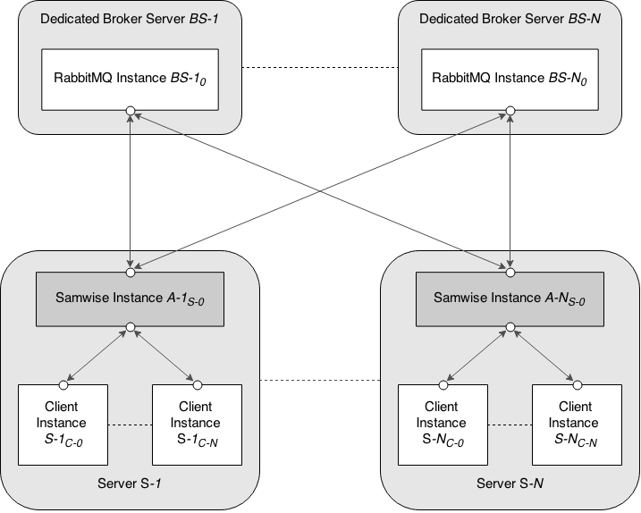

# SAMWISE #

Samwise is a store and forward messaging service for AMQP Messaging with RabbitMQ. It accepts messages via [ZMTP](http://zeromq.org) and implements both round robined and redundant publishing as distribution strategies. It was written as the basis for my thesis to acquire the bachelors degree for computer science. Please refer to the dedicated readme's for more information.

## Overview ##

This repository contains several different subprojects:

- **/client:** Contains clients that can communicate with running samwise instances. There is a C library containing all client logic. The current ruby implementation accesses this functionality by using the ffi language bindings.
- **/poc** Proof of concept playground. Used to play around with the RabbitMQ-C library.
- **/samwise** The main project - the service.
- **/rfc** Contains the specification that describes the protocol of how samwise clients and the service communicate with each other.

## Notes ##

* create [heap profiles](http://valgrind.org/docs/manual/ms-manual.html) `valgrind --tool=massif --time-unit=B PROG` then read them with `ms_print`
* capture local amqp network traffic with tshark: `sudo tshark -f "tcp port 5672" -R amqp -i lo`

